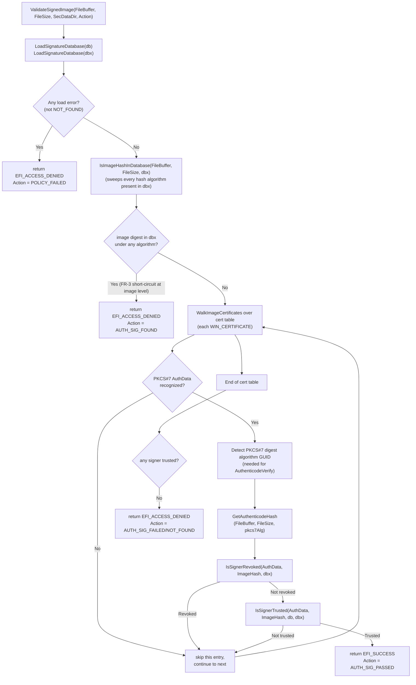
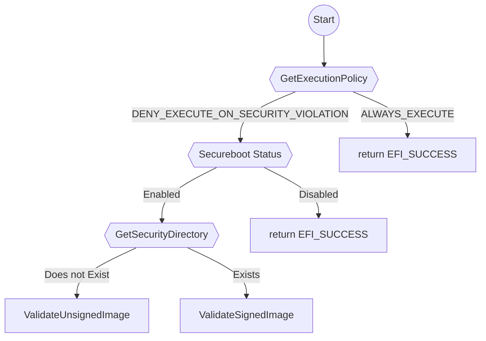
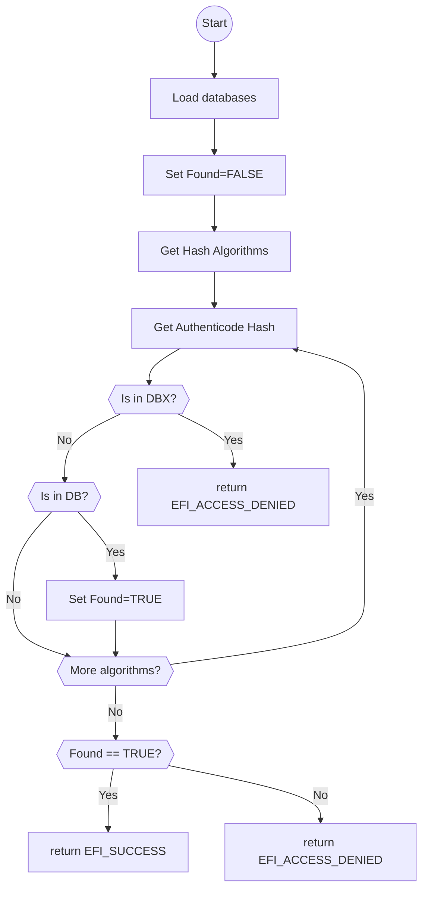
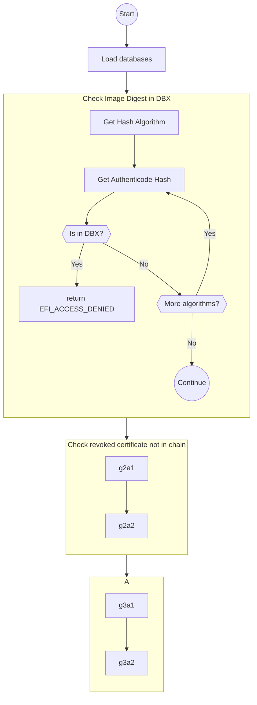

# `ValidateSignedImage` Implementation Plan

> **Companion documents**:
> - `DxeImageVerificationLib_RewriteArchitecture.md` — overall design, requirements
>   (FR-1 … FR-11), layered architecture, migration strategy. This plan focuses
>   exclusively on **Layer 4 — Verification Engine (signed-image path)** and the
>   helpers required to build it.
> - `SecurityPkg/Library/DxeImageVerificationLib2/` — the WIP rewrite. The
>   constructor, handler, policy layer, support layer, database layer, and the
>   unsigned-image path are already in place. `ValidateSignedImage` is currently a
>   stub that returns `EFI_UNSUPPORTED`.

---

## 1. Scope

This document plans the implementation of `ValidateSignedImage` and the helpers
it needs in `SecurityPkg/Library/DxeImageVerificationLib2`. It is scoped to:

- Signed-image verification (PE/COFF images carrying a non-empty Security data
  directory).
- Helpers that operate **only** on the loaded `db` / `dbx` buffers and the
  in-memory image — no `gRT->GetVariable` access in Layer 4 code (database access
  is centralized in `Database.c`).
- The behavior changes required by the architecture doc: FR-3 (dbx overrides
  db), FR-4 (multi-certificate short-circuit on trust), FR-9 (TBS cert-hash
  trust anchors in `db`), FR-10 (Authenticode hash via `BaseCryptLib`), FR-11
  (does not apply — signed-image path's digest algorithm is dictated by PKCS#7).

**Out of scope:** `dbt`-based timestamp exceptions. The library deliberately
does not consult the `dbt` variable. A signer (or its TBS cert hash) found in
`dbx` is treated as revoked unconditionally — there is no timestamp grace
window. The `EFI_TIME` field on dbx entries is ignored.

This plan does **not** cover Layer 5 (reporting, authority measurement,
`EFI_IMAGE_EXECUTION_INFO_TABLE`); those are handled in later phases of the
broader rearchitecture.

---

## 2. Where the plan lives in the repository

- This plan: [DxeImageVerificationLib_ValidateSignedImagePlan.md](DxeImageVerificationLib_ValidateSignedImagePlan.md)
  (workspace root, alongside the rewrite-architecture doc).
- Implementation:
  [SecurityPkg/Library/DxeImageVerificationLib2/](SecurityPkg/Library/DxeImageVerificationLib2/)
- Tests:
  [SecurityPkg/Library/DxeImageVerificationLib2/GoogleTest/](SecurityPkg/Library/DxeImageVerificationLib2/GoogleTest/)

New source files proposed (paths are relative to the library directory):

| File | Purpose |
|------|---------|
| `Signed.c` / `Signed.h` | `ValidateSignedImage` orchestrator, `WIN_CERTIFICATE` iteration, PKCS#7 `AuthData` extraction, digest-algorithm detection. |
| `Signer.c` / `Signer.h` | Per-signer revocation/trust helpers operating on loaded `db`/`dbx` buffers and a single `AuthData` blob. Includes TBS cert-hash matching (FR-9). |

Test files (new):

| File | Purpose |
|------|---------|
| `GoogleTest/SignedGoogleTest.cpp` | Tests for cert-table iteration, `AuthData` extraction, digest-algorithm detection, and the top-level `ValidateSignedImage` decision matrix. |
| `GoogleTest/SignerGoogleTest.cpp` | Tests for X.509 / TBS-hash matching against constructed `db`/`dbx` buffers. Uses `MockBaseCryptLib` to stub `AuthenticodeVerify`, `Pkcs7GetSigners`, `X509GetTBSCert`. |

Updates required to existing files:

- `DxeImageVerificationLib.inf` — add new `.c`/`.h` to `[Sources]`; add
  `gEfiCertPkcs7Guid` is already present; no new GUIDs needed beyond those
  already declared.
- `GoogleTest/DxeImageVerificationLibGoogleTest.inf` — add the two new
  `.cpp` files and a dependency on `MockBaseCryptLib`.
- `DxeImageVerificationLib.h` — declare the public-to-the-library prototype
  for `ValidateSignedImage` (already declared) and update the doxygen header
  to reflect the real implementation contract (currently says
  `EFI_UNSUPPORTED`).
- `Database.h` / `Database.c` — generalize `IsCertHashFoundInDbx` semantics
  into a new walker that works against **either** `db` or `dbx` buffers
  (see §4.3). The architecture doc names this `FindCertHashInDatabase`.

---

## 3. End-to-end behavior `ValidateSignedImage` must implement

Inputs (already provided by the handler in `DxeImageVerificationLib.c`):

```c
EFI_STATUS
ValidateSignedImage (
  IN  VOID                            *FileBuffer,
  IN  UINTN                           FileSize,
  IN  CONST EFI_IMAGE_DATA_DIRECTORY  *SecDataDir,
  OUT EFI_IMAGE_EXECUTION_ACTION      *Action
  );
```

Output decision matrix (status, `*Action`). The action values map directly
to the UEFI 2.11 §32.4.2 specification of `EFI_IMAGE_EXECUTION_INFO.Action`
(Table 32.6, *Authentication Attempt Status Codes*):

| Condition | Status | `*Action` | Spec condition (Table 32.6) |
|---|---|---|---|
| Cert-table is structurally malformed (truncated, oversize, bad `dwLength`, etc.) | `EFI_ACCESS_DENIED` | `AUTH_SIG_FAILED` | "The image signature check failed." |
| Image hash (computed under **any** hash algorithm present in `dbx`'s image-hash entries) is in `dbx` | `EFI_ACCESS_DENIED` | `AUTH_SIG_FOUND` | "The image digest is in the forbidden database." |
| At least one `WIN_CERTIFICATE` produces a trusted signer not revoked by `dbx` | `EFI_SUCCESS` | `AUTH_SIG_PASSED` | "An image certificate is in the authorized database" / "The image digest is in the authorized database." |
| All `WIN_CERTIFICATE` entries are exhausted; at least one signer cert (or its TBS hash) was found in `dbx` and no signer in the cert table was independently trusted | `EFI_ACCESS_DENIED` | `AUTH_SIG_FAILED` | "An image certificate is in the forbidden database" / "a digest of an image certificate is in the forbidden database." |
| All `WIN_CERTIFICATE` entries are exhausted; no signer was in `dbx`, and no signer was in `db` | `EFI_ACCESS_DENIED` | `AUTH_SIG_NOT_FOUND` | "The image certificate is not found in the authorized database, and the image digest is not in the authorized database." |
| Database load failure (`db` / `dbx` `GetVariable` returns an error other than `NOT_FOUND`) | `EFI_ACCESS_DENIED` | `POLICY_FAILED` | "Authentication failed because of (unspecified) firmware security policy." |

Notes:

- `AUTH_UNTESTED` ("the image contained no certificates") is **not produced**
  by `ValidateSignedImage`. That value belongs to the unsigned path; by the
  time `ValidateSignedImage` is entered, a cert table exists.
- On the success path the handler short-circuits before writing to the
  `EFI_IMAGE_EXECUTION_INFO_TABLE`, so `*Action = AUTH_SIG_PASSED` is the
  spec-correct value but is typically never consumed by callers. It is still
  written so that diagnostic consumers (e.g. an audit shim that inspects
  `*Action` regardless of return status) observe the spec-mandated code.

### 3.1 High-level flow



### 3.2 Mapping image-level revocation vs. not-found

UEFI 2.11 §32.4.2 Table 32.6 distinguishes three reasons for failing a signed
image, and one reason for accepting it. The new library produces
`ImageHashInDbx` once up front (image digest matched in `dbx` under any
algorithm present in `dbx`'s image-hash entries) and tracks
`AnySignerRevoked` across the cert-table walk (any signer cert or its TBS
hash matched in `dbx`). The final `*Action` is selected as follows:

```c
if (AnySignerTrusted) {
    *Action = EFI_IMAGE_EXECUTION_AUTH_SIG_PASSED;     // "image cert/digest in db"
} else if (ImageHashInDbx) {
    *Action = EFI_IMAGE_EXECUTION_AUTH_SIG_FOUND;      // "image digest in dbx"
} else if (AnySignerRevoked) {
    *Action = EFI_IMAGE_EXECUTION_AUTH_SIG_FAILED;     // "image cert (or its digest) in dbx"
} else {
    *Action = EFI_IMAGE_EXECUTION_AUTH_SIG_NOT_FOUND;  // "cert not in db AND digest not in db"
}
```

When the image-hash precheck fires, the cert-table walk is skipped entirely
— there is no point in evaluating signers for an image whose digest is
already denied at the image level.

Precedence rationale:

- `AUTH_SIG_PASSED` is set only when the success short-circuit fires (FR-4).
  In that case the function returns `EFI_SUCCESS` and the handler does not
  log to `EFI_IMAGE_EXECUTION_INFO_TABLE`, but the `*Action` value is still
  set so diagnostic callers observe the spec-mandated code.
- `AUTH_SIG_FOUND` takes precedence over the signer-level outcomes (FR-3:
  `dbx` overrides `db` at the image level).
- `AUTH_SIG_FAILED` is preferred over `AUTH_SIG_NOT_FOUND` when at least one
  signer was actively revoked, matching the original library's behaviour
  and the spec's "image cert/digest in dbx" condition.

---

## 4. Function-by-function plan

All function contracts below are stated as the doxygen-equivalent summary. Per
the user's standing rule, the full doxygen blocks must appear identically in
both `.h` and `.c`. Function descriptions are kept short.

### 4.1 `Signed.h` / `Signed.c`

#### `ValidateSignedImage`

- Already declared in [DxeImageVerificationLib.h](SecurityPkg/Library/DxeImageVerificationLib2/DxeImageVerificationLib.h).
- Move the implementation out of `DxeImageVerificationLib.c` into `Signed.c`
  so the orchestrator file stays focused on the handler.
- Logic:
  1. Load `db` and `dbx` via existing `LoadSignatureDatabase`. Any non-
     `NOT_FOUND` failure → `EFI_ACCESS_DENIED` with `*Action = POLICY_FAILED`.
  2. **Image-hash precheck against `dbx`.** Call `IsImageHashInDatabase`
     (see below) with the loaded `dbx` buffer. The helper computes the
     Authenticode hash once per image-hash algorithm actually present in
     `dbx` (SHA-1 / SHA-256 / SHA-384 / SHA-512) and short-circuits on the
     first match. If any match is found, set `*Action = AUTH_SIG_FOUND`
     and return `EFI_ACCESS_DENIED` — the cert-table walk is skipped
     entirely. This step is intentionally decoupled from PKCS#7: the
     algorithms the signer chose for *its* digest are independent of the
     algorithms a platform owner chose when populating `dbx` image-hash
     entries.
  3. Initialize `AnySignerRevoked = FALSE`.
  4. Iterate cert-table entries via `WalkImageCertificates`. Each callback:
     - Extract PKCS#7 `AuthData` via `ExtractPkcs7AuthData`. Continue on
       unsupported `wCertificateType`.
     - Detect the PKCS#7 digest GUID via `GetAuthDataDigestAlgorithm`.
       This GUID drives `AuthenticodeVerify` only — it is **not** used
       for any `dbx` image-hash comparison.
     - Compute the image hash under that GUID via `GetAuthenticodeHash`.
       This hash is what `AuthenticodeVerify` requires.
     - Run `IsSignerRevoked` (see §4.2). If revoked, set
       `AnySignerRevoked = TRUE` and continue.
     - Run `IsSignerTrusted` (see §4.2). If trusted, set
       `*Action = AUTH_SIG_PASSED` and abort the walk with success.
  5. After the walk, map the result to the §3.2 action table.

#### `WalkImageCertificates`

- Callback-based iterator parallel to `WalkSignatureDatabase`. Centralizes
  bounds-checking of `WIN_CERTIFICATE` headers and the `dwLength` alignment
  rules from the PE/COFF spec.
- Each `EFI_STATUS` returned by the callback is interpreted exactly the way
  `WalkSignatureDatabase` does (`EFI_SUCCESS` keeps walking, `EFI_ABORTED`
  ends the walk with success, any other error propagates).
- Contract:

  ```c
  typedef
  EFI_STATUS
  (EFIAPI *WIN_CERTIFICATE_CALLBACK)(
    IN CONST WIN_CERTIFICATE  *Cert,
    IN VOID                   *Context  OPTIONAL
    );

  EFI_STATUS
  WalkImageCertificates (
    IN  CONST UINT8                  *FileBuffer,
    IN  UINTN                        FileSize,
    IN  CONST EFI_IMAGE_DATA_DIRECTORY *SecDataDir,
    IN  WIN_CERTIFICATE_CALLBACK     Callback,
    IN  VOID                         *Context  OPTIONAL
    );
  ```

- Validation rules (copy/port from the original
  `DxeImageVerificationHandler` loop in
  [DxeImageVerificationLib.c](SecurityPkg/Library/DxeImageVerificationLib/DxeImageVerificationLib.c#L1918-L1976)):
  - `SecDataDir->VirtualAddress + SecDataDir->Size` must fit inside
    `FileSize`.
  - Each entry must be at least `sizeof (WIN_CERTIFICATE)` and
    `dwLength <= remaining`; the next offset is
    `OffSet + ALIGN_VALUE (dwLength, 8)` (per the spec; the original code
    uses an `ALIGN_SIZE` helper).
  - Any structural error → `EFI_VOLUME_CORRUPTED`.

#### `ExtractPkcs7AuthData`

- Pure function: given a `WIN_CERTIFICATE`, returns `AuthData`/`AuthDataSize`
  pointers into the same buffer for the two supported types
  (`WIN_CERT_TYPE_PKCS_SIGNED_DATA` and `WIN_CERT_TYPE_EFI_GUID` with
  `gEfiCertPkcs7Guid`). Returns `EFI_UNSUPPORTED` for unrecognized types so
  the walker callback can `continue` cleanly.

#### `GetAuthDataDigestAlgorithm`

- **Critical helper, currently absent.** The existing
  `BaseCryptLib::AuthenticodeVerify` consumes a pre-computed image hash
  whose algorithm must match the PKCS#7 signer-info `digestAlgorithm`
  field. To produce that hash, the library needs to map the PKCS#7
  `AuthData` blob → algorithm GUID. Today there is no library API that
  does this. The original library did this via brittle ASN.1 byte
  sniffing in `HashPeImageByType` ([reference](SecurityPkg/Library/DxeImageVerificationLib/DxeImageVerificationLib.c#L626)).
- **Important scope clarification.** This helper is used *only* for the
  PKCS#7 verification step (§4.2 `IsSignerRevoked` / `IsSignerTrusted`).
  It is **not** consulted for the `dbx` image-hash precheck — that path
  sweeps the algorithms found in `dbx` itself, independent of PKCS#7.
- Two implementation options:
  - **Option A (preferred, smaller change)**: implement the OID lookup
    inside this library using existing `BaseCryptLib` primitives
    (`Pkcs7GetSigners` to obtain the signer cert; `X509GetSignatureAlgorithm`
    or the signer-info `digestAlgorithm` field exposed by an existing
    accessor) plus a small OID → GUID table for SHA-1/256/384/512.
  - **Option B (cleaner long-term)**: add a `BaseCryptLib` API such as
    `Pkcs7GetDigestAlgorithm(AuthData, AuthDataSize, OUT EFI_GUID *)` and
    consume it. Track this as a follow-up in CryptoPkg; do not block this
    feature on it.
- Recommendation: ship Option A inside `Signed.c` as a private static
  function; file a CryptoPkg work item to lift the helper into
  `BaseCryptLib` as part of FR-10's continuing migration.

#### `IsImageHashInDatabase`

```c
EFI_STATUS
IsImageHashInDatabase (
  IN  CONST UINT8  *FileBuffer,
  IN  UINTN        FileSize,
  IN  CONST VOID   *Database  OPTIONAL,
  IN  UINTN        DatabaseSize,
  OUT BOOLEAN      *IsFound
  );
```

- Sweeps the image-hash algorithms actually present in `Database` and
  short-circuits on the first match. Algorithm coverage is driven by what
  the database contains — there is no relationship to any PKCS#7 signer.
- Implementation:
  1. Call existing `GetDatabaseHashAlgorithms` to discover which of
     `gEfiCertSha1/256/384/512Guid` actually appear in `Database`.
  2. For each present algorithm, call `GetAuthenticodeHash (FileBuffer,
     FileSize, alg)` to compute the image digest under that algorithm.
  3. Hand the digest to existing `IsSignatureFoundInDatabase`. On the first
     match, set `*IsFound = TRUE` and return.
  4. If no algorithm matches, `*IsFound = FALSE`.
- A `NULL` / zero-size `Database` is valid input and returns
  `*IsFound = FALSE` without computing any hashes.
- Returns `EFI_SUCCESS` on a clean decision (matched or not); reserves
  error codes for malformed databases (`EFI_VOLUME_CORRUPTED`) and
  cryptographic failures (propagated from `GetAuthenticodeHash`).
- Lives in `Signed.c` next to the orchestrator because it composes
  image-level (PE/COFF) and database-level primitives; the `Database.c`
  layer intentionally does not depend on `BaseCryptLib` Authenticode
  hashing.

### 4.2 `Signer.h` / `Signer.c`

These operate **only on already-loaded `db`/`dbx` buffers** plus a
single `AuthData` blob. No `gRT->GetVariable` calls live here.

#### `IsSignerRevoked`

```c
EFI_STATUS
IsSignerRevoked (
  IN  CONST UINT8  *AuthData,
  IN  UINTN        AuthDataSize,
  IN  CONST VOID   *Dbx       OPTIONAL,
  IN  UINTN        DbxSize,
  OUT BOOLEAN      *IsRevoked
  );
```

- Mirrors the original `IsForbiddenByDbx` but operates on a preloaded `dbx`.
  The library does **not** consult `dbt`; any match in `dbx` revokes the
  signer unconditionally. Logic, in order:
  1. For each X.509 entry in `dbx`, call `AuthenticodeVerify`. A successful
     verify against any `dbx` cert means revoked.
  2. Use `Pkcs7GetSigners` to obtain the signer-chain certificate stack.
  3. For each certificate in the chain, run `FindCertHashInDatabase` against
     `dbx`. If a TBS-hash match is found, the image is revoked.
  4. If neither path triggers, `*IsRevoked = FALSE`.

- Returns `EFI_SUCCESS` (with `*IsRevoked`) for the policy decision;
  reserves error codes for malformed PKCS#7 / OOM only.

#### `IsSignerTrusted`

```c
EFI_STATUS
IsSignerTrusted (
  IN  CONST UINT8  *AuthData,
  IN  UINTN        AuthDataSize,
  IN  CONST UINT8  *ImageDigest,
  IN  UINTN        ImageDigestSize,
  IN  CONST VOID   *Db        OPTIONAL,
  IN  UINTN        DbSize,
  IN  CONST VOID   *Dbx       OPTIONAL,
  IN  UINTN        DbxSize,
  OUT BOOLEAN      *IsTrusted
  );
```

- Two trust paths consulted in order:
  1. **Raw X.509 trust anchor.** For each `gEfiCertX509Guid` entry in `db`,
     call `AuthenticodeVerify (AuthData, AuthDataSize, RootCert, RootSize,
     ImageDigest, ImageDigestSize)`. On success, run a `dbx` revocation
     check against this specific root cert (TBS-hash) per the original
     `IsAllowedByDb` semantics. If the cert survives the `dbx` check, mark
     trusted.
  2. **TBS cert-hash trust anchor (FR-9).** For each `gEfiCertX509Sha256/384/512`
     entry in `db`, walk the PKCS#7 signer chain and compute TBS hashes.
     First chain certificate whose TBS hash matches a `db` entry becomes
     the trust anchor. Before accepting, run the `dbx` TBS-hash revocation
     check against the **entire chain** (FR-9 chain-level dbx override).
- Returns `EFI_SUCCESS` with `*IsTrusted`. Failure returns reserved for OOM
  / malformed PKCS#7.

#### Helpers expected to live in `Signer.c` (file-static)

- `MatchSignerAgainstX509Database` — walk one signature-database buffer and
  call `AuthenticodeVerify` for every `gEfiCertX509Guid` entry; stop on the
  first match.
- `ComputeTbsHashOfCert` — call `X509GetTBSCert` then a digest under one of
  `gEfiCertX509Sha{256,384,512}Guid`. Reused by `IsSignerRevoked` and
  `IsSignerTrusted`.
- `WalkPkcs7SignerChain` — small wrapper around `Pkcs7GetSigners` that
  exposes the chain as `(CertPtr, CertSize)` pairs. Encapsulates the
  awkward `CertNumber + (UINT32 length, UINT8 cert)*N` layout decoded
  manually in the original library at
  [DxeImageVerificationLib.c L1389-L1395](SecurityPkg/Library/DxeImageVerificationLib/DxeImageVerificationLib.c#L1389-L1395).
  Returns parsed pointers via a callback, freeing the underlying
  `Pkcs7FreeSigners` buffer when the walk completes.

### 4.3 Required generalization of `Database.h`

The original `IsCertHashFoundInDbx` is dbx-specific. To support FR-9
(TBS cert-hash in `db`), generalize:

```c
EFI_STATUS
FindCertHashInDatabase (
  IN  CONST UINT8     *Certificate,
  IN  UINTN           CertificateSize,
  IN  CONST VOID      *Database  OPTIONAL,
  IN  UINTN           DatabaseSize,
  OUT BOOLEAN         *IsFound
  );
```

- Walks the database via `WalkSignatureDatabase` (existing).
- For each list whose `SignatureType` is `gEfiCertX509Sha256/384/512`,
  selects the matching digest algorithm, calls `X509GetTBSCert` once per
  candidate cert, hashes the TBS, and compares against each entry.
- Per the UEFI spec for `EFI_CERT_X509_Sha{256,384,512}`, each signature
  data is laid out as `TBSHash || EFI_TIME`. `FindCertHashInDatabase` only
  compares the leading hash bytes; the trailing time field is ignored. The
  library does not implement `dbt` timestamp exceptions, so the time field
  is never consulted.
- Old test names in `DatabaseGoogleTest.cpp` continue to apply; add new
  tests that exercise the `Database == db` path.

---

## 5. Test plan

All tests use `UnitTestFrameworkPkg`'s `HOST_APPLICATION` mode. Mock
`AuthenticodeVerify`, `Pkcs7GetSigners`, `X509GetTBSCert`, and
`GetAuthenticodeHash` via `MockBaseCryptLib`.

### 5.1 `SignedGoogleTest.cpp`

- `WalkImageCertificates`:
  - Empty cert table → callback never invoked, returns `EFI_SUCCESS`.
  - Single well-formed entry → callback called once with the right pointer.
  - Truncated header / `dwLength` larger than remaining → `EFI_VOLUME_CORRUPTED`.
  - `dwLength` not 8-byte aligned at the tail → `EFI_VOLUME_CORRUPTED`.
  - Multiple entries with mixed `wCertificateType` values.
- `ExtractPkcs7AuthData`:
  - `WIN_CERT_TYPE_PKCS_SIGNED_DATA` — returns `dwLength - sizeof(Hdr)`.
  - `WIN_CERT_TYPE_EFI_GUID` + `gEfiCertPkcs7Guid` — returns offset-of(CertData).
  - `WIN_CERT_TYPE_EFI_GUID` + other GUID → `EFI_UNSUPPORTED`.
  - Header too small → `EFI_VOLUME_CORRUPTED`.
- `GetAuthDataDigestAlgorithm`:
  - Recognizes SHA-1/256/384/512 OIDs.
  - Unknown OID → `EFI_UNSUPPORTED`.
  - Malformed/truncated PKCS#7 → `EFI_VOLUME_CORRUPTED`.
- `IsImageHashInDatabase`:
  - `NULL` / zero-size database → `*IsFound = FALSE`, no hashing performed.
  - Database with no image-hash signature lists → `*IsFound = FALSE`.
  - Database with a single SHA-256 image-hash list, image hashes to a match
    → `*IsFound = TRUE`.
  - Database with SHA-256 and SHA-384 image-hash lists, image matches only
    under SHA-384 → `*IsFound = TRUE` (proves the helper sweeps every
    algorithm present, not just the first).
  - Database with a SHA-256 image-hash list, image hash mismatches →
    `*IsFound = FALSE`.
  - Cross-algorithm independence: PKCS#7 declares SHA-256 but `dbx`
    contains only SHA-512 image-hash entries that match the image's
    SHA-512 digest → `*IsFound = TRUE` (the precheck must not be limited
    to the PKCS#7-declared algorithm).
  - Malformed database → `EFI_VOLUME_CORRUPTED`.
- `ValidateSignedImage` (decision matrix):
  - Image hash in dbx under an algorithm **different** from the PKCS#7
    signer's digest algorithm, signers otherwise trusted →
    `EFI_ACCESS_DENIED`, `AUTH_SIG_FOUND`, **and** the cert-table walk is
    not entered (verified by mock expectations on `AuthenticodeVerify`).
  - Image hash in dbx + multiple signers all trusted → `EFI_ACCESS_DENIED`,
    `AUTH_SIG_FOUND` (FR-3 image-level override).
  - Two signers, first revoked, second trusted → `EFI_SUCCESS` (FR-4).
  - Two signers, both revoked, none trusted → `EFI_ACCESS_DENIED`,
    `AUTH_SIG_FAILED`.
  - Two signers, neither revoked, neither trusted → `EFI_ACCESS_DENIED`,
    `AUTH_SIG_NOT_FOUND`.
  - Trust via raw X.509 in `db`.
  - Trust via TBS cert-hash in `db` (FR-9), no `dbx` overlap.
  - Trust via TBS cert-hash in `db`, but another chain cert is in `dbx`
    TBS-hash (FR-9 chain-level override) → denied.
  - Database load failure (`db` or `dbx` `GetVariable` returns an error
    other than `NOT_FOUND`) → `EFI_ACCESS_DENIED`, `POLICY_FAILED`.

### 5.2 `SignerGoogleTest.cpp`

- `IsSignerRevoked` against synthetic `dbx`:
  - Empty `dbx` → not revoked.
  - X.509 cert in `dbx` that `AuthenticodeVerify` (mocked) accepts → revoked.
  - TBS-hash match in `dbx` → revoked.
- `IsSignerTrusted` against synthetic `db`:
  - X.509 trust anchor present → trusted (and `dbx` revocation of that
    anchor is honored).
  - TBS-hash trust anchor present (FR-9) → trusted.
  - TBS-hash trust anchor + any chain cert in `dbx` → not trusted
    (FR-3/FR-9 interaction).

### 5.3 Coverage target

Aim for ≥ 95 % line coverage across `Signed.c` and `Signer.c` when running
the CI coverage build documented in the skill instructions. The decision
matrix in §5.1 plus the targeted helper tests in §5.2 should hit every
branch in those files.

---

## 6. Implementation order (incremental, build-green at every step)

1. **`Database.c` generalization (`FindCertHashInDatabase`) + tests.**
   No callers yet; existing tests for `IsSignatureFoundInDatabase` continue
   to pass.
2. **`Signer.c` (`IsSignerRevoked`, `IsSignerTrusted`) + unit tests.** Uses
   `FindCertHashInDatabase`. Still no caller.
3. **`Signed.c` scaffolding (`WalkImageCertificates`, `ExtractPkcs7AuthData`,
   `GetAuthDataDigestAlgorithm`, `IsImageHashInDatabase`) + unit tests.**
   No behavior change yet — `ValidateSignedImage` still returns
   `EFI_UNSUPPORTED`.
4. **Wire up `ValidateSignedImage` in `Signed.c`** and remove the stub from
   `DxeImageVerificationLib.c`. Update the doxygen contract in
   `DxeImageVerificationLib.h`. Add the integration tests from §5.1.
5. **Run `UncrustifyCheck`** and the full unit-test suite (including
   coverage). Iterate until coverage and lint are clean.

At every step, the library still builds (`stuart_ci_build` with
`BUILDMODULE=...DxeImageVerificationLib.inf`) and all existing tests pass.

---

## 7. Notes for future maintainers

- **No globals.** Per the skill instructions, no module-scope mutable state
  may be introduced. All per-call state (`db`/`dbx` buffers, image digest,
  decision flags) must live in stack-allocated structs threaded through the
  helpers. The current `ValidateUnsignedImage` already follows this pattern;
  mirror it.
- **`dbt` is intentionally not consulted.** The original library walked the
  `dbt` (timestamp authority) variable to grant a grace window for signers
  whose certificates appeared in `dbx`. This library deliberately drops that
  behavior: any match in `dbx` revokes unconditionally. Do **not** reintroduce
  `dbt` lookups without revisiting the architecture doc \u2014 the simplified
  model is what keeps the signer/trust helpers small and auditable, and the
  product decision is that timestamp grace is more risk than benefit.- **The `dbx` image-hash precheck is decoupled from PKCS#7.** A signer's
  PKCS#7 `digestAlgorithm` declares how *that signer* hashed the image for
  *its* signature. A platform owner populating `dbx` is free to choose any
  hash algorithm independently. The two have no relationship. The precheck
  in `IsImageHashInDatabase` therefore sweeps every hash algorithm actually
  present in `dbx`'s image-hash entries, hashes the image once per
  algorithm, and short-circuits on the first match — regardless of what
  any PKCS#7 signer chose. Do **not** "optimize" this back to only hashing
  under the PKCS#7-declared algorithm: it silently defeats `dbx` entries
  written under a stronger (or different) algorithm.- **PKCS#7 cert-stack ownership.** `Pkcs7GetSigners` allocates two buffers
  (`CertStack`, `TrustedCert`); both must be released with
  `Pkcs7FreeSigners`. `WalkPkcs7SignerChain` should own this lifetime via
  RAII-style scoping so callers cannot leak on early-return paths.
- **Bounds-checking on `dwLength`.** `WIN_CERTIFICATE` headers are
  attacker-controlled. Every arithmetic operation on `dwLength` must guard
  against overflow before subtraction (`SecDataDirLeft - dwLength`,
  `ALIGN_VALUE` round-up). Port the checks from the original handler
  verbatim — the bug surface is well-understood and any deviation must be
  reviewed.
- **FR-4 visibility from logs.** When the new short-circuit behavior
  silently allows an image that the old library would have denied,
  diagnostics matter. Each per-cert decision should emit a `DEBUG_INFO`
  trace identifying the cert offset and the verdict (trusted / revoked /
  not present in either database) so platform validators can confirm the
  intended behavior change in their boot logs.
- **`GetAuthDataDigestAlgorithm` is a wart.** This helper exists only
  because `BaseCryptLib::GetAuthenticodeHash` requires an explicit algorithm
  GUID. The clean long-term fix is to extend `BaseCryptLib` per FR-10
  open-question (4). Until that lands, keep the OID table small (the four
  algorithms in `mKnownImageHashGuids`) and centralize it in one place so
  the eventual migration is a single deletion.
- **Authority measurement (Layer 5) is out of scope here.** The success and
  failure paths in `ValidateSignedImage` must leave a hook point (the
  matched `EFI_SIGNATURE_LIST` / `EFI_SIGNATURE_DATA` pointer plus the
  database it came from) discoverable by the caller. The simplest way is
  to extend the `OUT` parameters of `ValidateSignedImage` in a follow-up
  change; for the initial implementation, log the match site at
  `DEBUG_INFO` and leave a `// TODO(Layer 5): authority measurement` marker
  at each call site.
- **Update the rewrite architecture doc** and (when it is finally written)
  the library's `README.md` whenever the helper surface changes. The skill
  instructions require it.

## Overall flow chart

### Handler Entry Point



### Validate Unsigned Image



### Validate Signed Image


