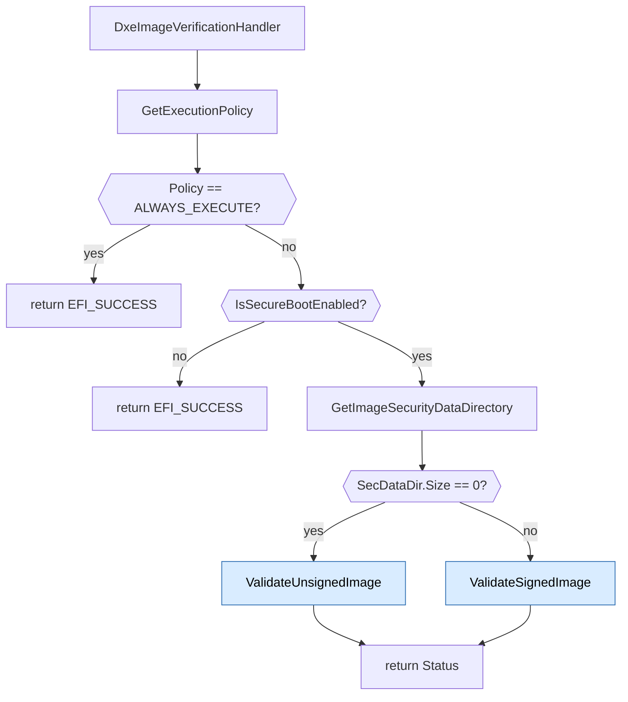
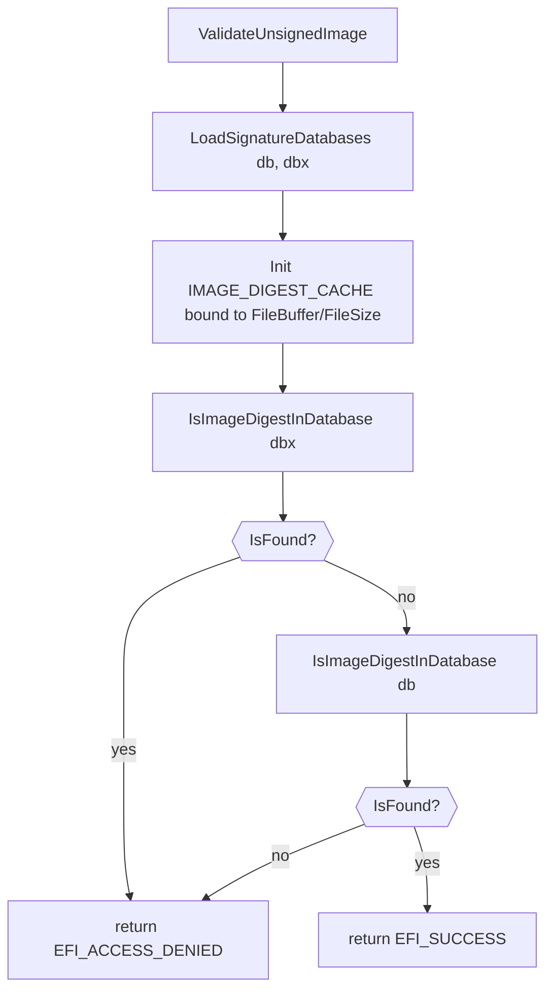
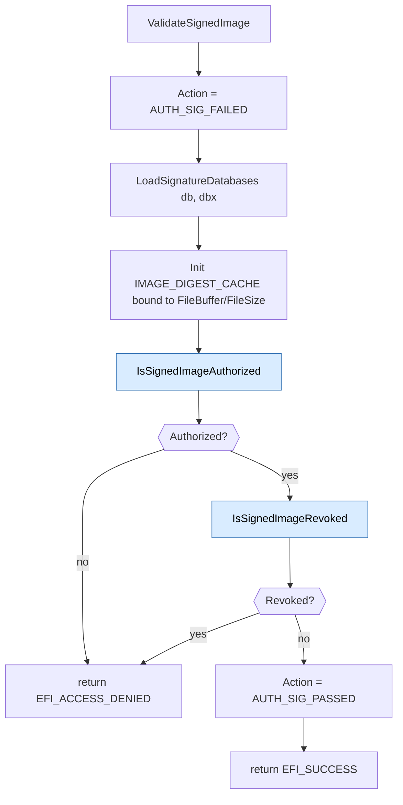
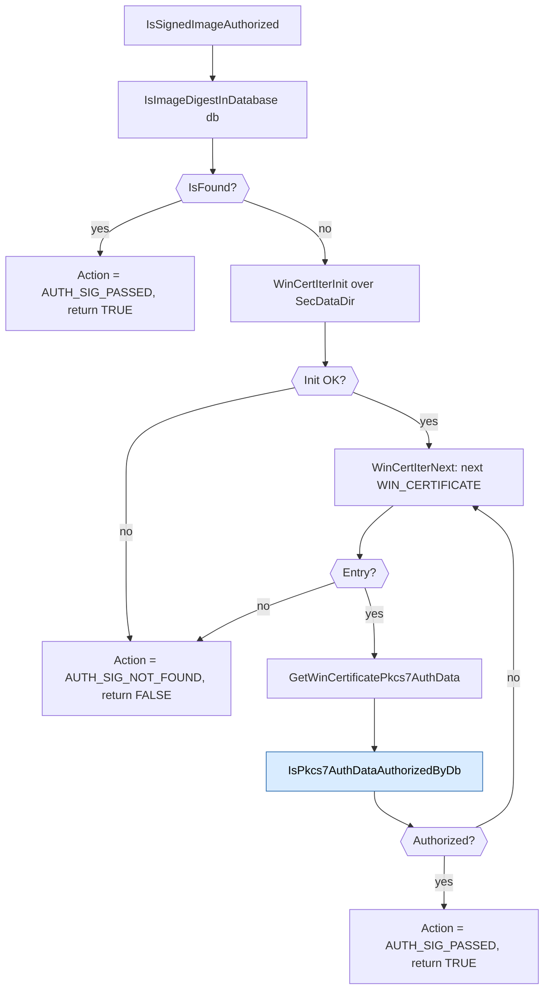
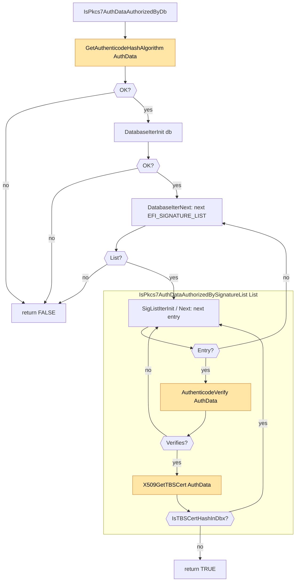

# DxeImageVerificationHandler Flow

This document describes the runtime flow of
`DxeImageVerificationHandler` in `SecurityPkg/Library/DxeImageVerificationLib2`.
It focuses on the three high-level phases:

1. **Policy validation** (entry-point gating)
2. **`ValidateUnsignedImage`** (image carries no embedded signature)
3. **`ValidateSignedImage`** (image carries one or more
   `WIN_CERTIFICATE` entries)

The shared `IMAGE_DIGEST_CACHE` constructed in (2) and (3) caches each
Authenticode digest the first time it is computed, so repeated lookups
across `db` / `dbx` and across signature lists do not recompute hashes.

## 1. Top-level flow

Key observations:

- `GetExecutionPolicy` runs **before** the Secure Boot check because
  it is cheap *and* the FV-dispatched-driver fast path (policy =
  `ALWAYS_EXECUTE`) is by far the most common path - only one or
  two calls per boot miss it - so short-circuiting there avoids
  the Secure Boot variable read and PE/COFF parse for the overwhelming
  majority of invocations.
- If Secure Boot is disabled the handler returns `EFI_SUCCESS` without
  inspecting the image. (Audit mode has been removed, so there is no
  longer a code path that inspects the image when Secure Boot is off.)
- A PE/COFF parse failure in `GetImageSecurityDataDirectory` is treated
  as a verification failure (its status is returned).
- The presence of any data in the security data directory (`Size > 0`)
  routes the image to the signed path; otherwise it is treated as
  unsigned.

## 2. `ValidateUnsignedImage`

The image has no embedded signature, so authorization is decided
entirely on the image hash. The hash is computed lazily for each
algorithm enrolled in `db` / `dbx` and cached in `IMAGE_DIGEST_CACHE`.

Verdict table:

| `dbx` lookup  | `db` lookup | Result               |
| ------------- | ----------- | -------------------- |
| error or hit  | -           | `EFI_ACCESS_DENIED`  |
| miss          | error / miss| `EFI_ACCESS_DENIED`  |
| miss          | hit         | `EFI_SUCCESS`        |

Rules of thumb:

- `dbx` is consulted **before** `db`. A revoked hash is denied even if
  the same hash also appears in `db`.
- `IsImageDigestInDatabase` walks every signature list in the
  supplied database. For each list whose `SignatureType` is a known
  image-hash GUID it computes the image's
  digest under that algorithm (via the cache), then byte-compares
  against every entry.
- A failure to load either database is fail-closed
  (`EFI_ACCESS_DENIED`), not propagated upward.
  ## 3. `ValidateSignedImage`

The image has one or more `WIN_CERTIFICATE` entries in its security
data directory. The function delegates to two pure helpers that share
the same `IMAGE_DIGEST_CACHE`:

- `IsSignedImageAuthorized` - does `db` accept the image?
- `IsSignedImageRevoked` - does `dbx` reject the image?

`Action` (the platform's `EFI_IMAGE_EXECUTION_ACTION` output) starts as
`AUTH_SIG_FAILED`, is updated by the helpers on definitive outcomes,
and is set to `AUTH_SIG_PASSED` only on full success.

### 3a. `IsSignedImageAuthorized`

Two-stage authorization. The cheap image-hash fast path runs first; the
expensive PKCS#7 signature walk runs only on a miss.

Per embedded `WIN_CERTIFICATE` entry, `IsPkcs7AuthDataAuthorizedByDb`:

Nodes shaded orange (`GetAuthenticodeHashAlgorithm`, `AuthenticodeVerify`)
are calls into `BaseCryptLib`.

For each verifying trust anchor, `X509GetTBSCert` extracts the TBS bytes,
then `IsTBSCertHashInDbx` performs the revocation check.

### 3b. `IsSignedImageRevoked`

> Currently a stub that always returns FALSE.
