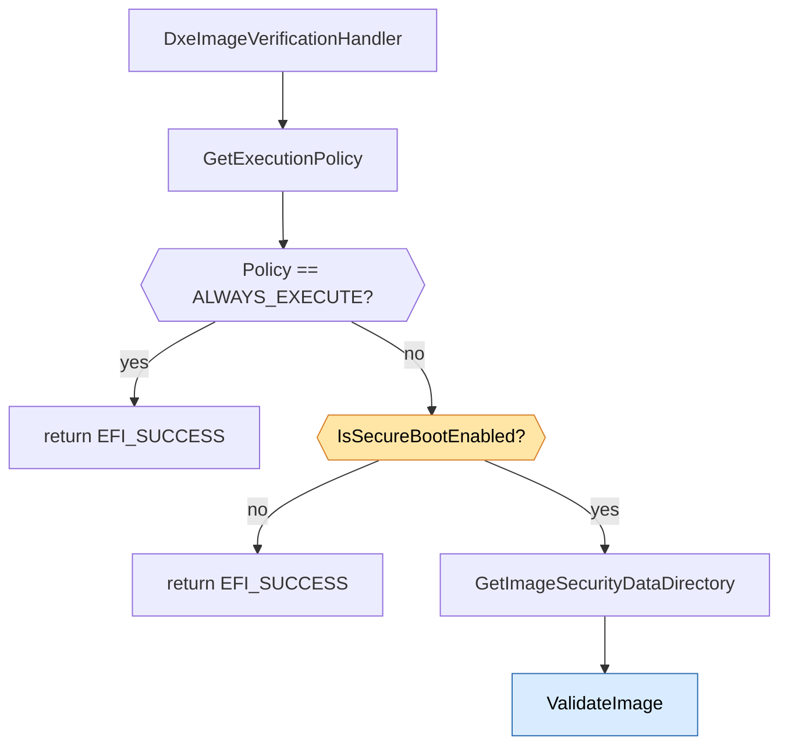
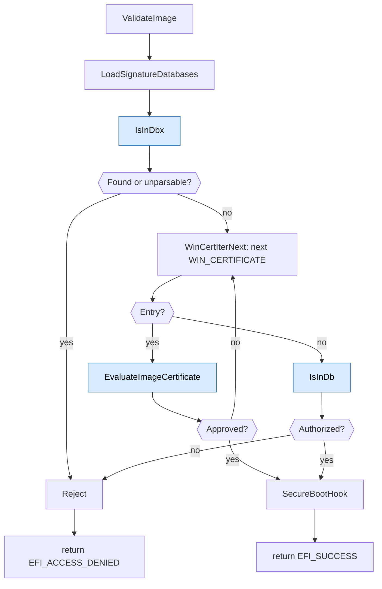
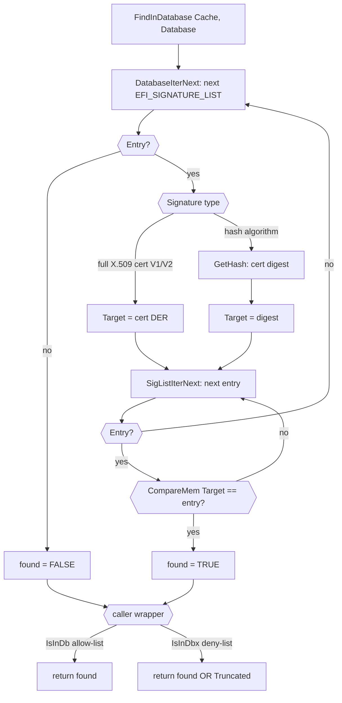
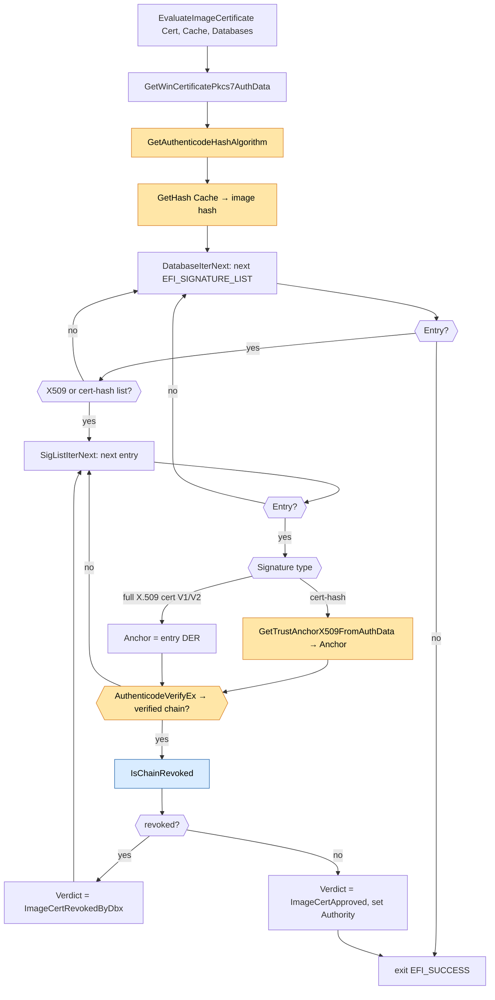
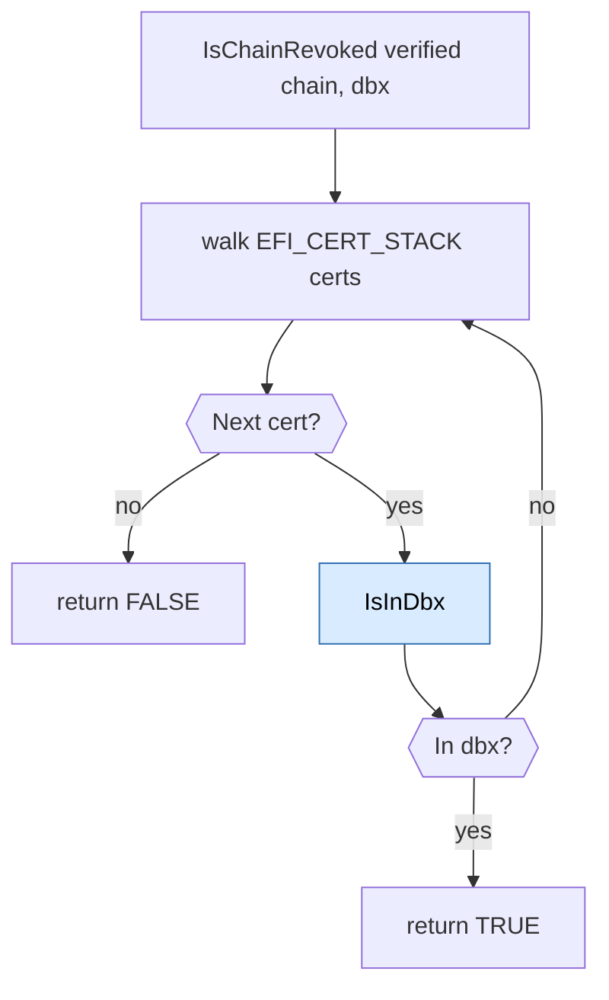

# DxeImageVerificationHandler Flow

This document describes the runtime flow of
`DxeImageVerificationHandler` in `SecurityPkg/Library/DxeImageVerificationLib2`.
It focuses on the following phases:

1. **Policy validation** (entry-point gating)
2. **`ValidateImage`** (the single, unified validator for both signed
   and unsigned images)
3. The helpers `ValidateImage` drives — `IsInDbx` / `IsInDb`
   (deny-list / allow-list membership search) and
   `EvaluateImageCertificate` (per-certificate evaluation, which
   resolves trust anchors and performs chain-relative revocation)

`ValidateImage` builds a single `DIGEST_CACHE` bound to the image and
threads it through every step, so each Authenticode digest is computed
at most once per algorithm regardless of how many `db` / `dbx` lists or
signatures are visited.

## About this library

`DxeImageVerificationLib` is a `NULL` library: it has no public class
interface. Linking it into a module runs its constructor, which
registers `DxeImageVerificationHandler` with the platform's Security2
architectural protocol. From then on, every image the DXE core loads is
routed through that handler, which returns `EFI_SUCCESS` to permit
execution or `EFI_ACCESS_DENIED` to block it.

### Recording the outcome

> **Note:** Reporting rejected images to the OS through the
> `EFI_IMAGE_EXECUTION_INFO_TABLE` has been **temporarily removed** and is
> slated for rework. The handler currently returns `EFI_ACCESS_DENIED` for a
> rejected image without publishing any table entry.

### Measuring the outcome

When an image is authorized **by a certificate**, the authorizing certificate
is measured into **PCR 7** via `SecureBootHook`, wrapped in a V1
`EFI_SIGNATURE_DATA` (a TBS-cert-hash `db` entry contributes the reconstructed
certificate, not the hash). Images authorized **by image hash** are not
measured, which keeps PCR 7 bound to signing authorities rather than one-off
image digests. To keep the PCR measurement faithful to UEFI Secure Boot
semantics, each distinct authority is measured **at most once per boot**: the
handler tracks the set of already-measured authorities and skips any it has
seen before, so loading many images authorized by the same certificate extends
PCR 7 only once for that authority.

> **Diagram conventions**
>
> - **Yellow** nodes are functions provided by external **library
>   classes** (e.g. `BaseCryptLib`, `SecureBootVariableLib`).
> - **Blue** nodes are functions owned by this library that are
>   **expanded in a later section**.
> - For simplicity the diagrams assume the setup calls (iterator init,
>   database load, etc.) neither truncate nor fail; the early-abort
>   branches are omitted.

## 1. Top-level flow

Key observations:

- `GetExecutionPolicy` runs **before** the Secure Boot check because
  it is cheap *and* the FV-dispatched-driver fast path (policy =
  `ALWAYS_EXECUTE`) is by far the most common path - so short-circuiting
  there avoids the Secure Boot variable read and PE/COFF parse for the
  overwhelming majority of invocations.
- If Secure Boot is disabled the handler returns `EFI_SUCCESS` without
  inspecting the image. (Audit mode has been removed, so there is no
  longer a code path that inspects the image when Secure Boot is off.)
- A PE/COFF parse failure in `GetImageSecurityDataDirectory` is treated
  as a verification failure (its status is returned).
- There is **one** validator. `ValidateImage` handles both signed and
  unsigned images; a `SecDataDir.Size == 0` simply yields an empty
  `WIN_CERTIFICATE` walk in step 2.

## 2. `ValidateImage`

`ValidateImage` orchestrates three steps against a shared
`DIGEST_CACHE`:

1. **Image-hash revocation.** Look up the image's Authenticode digest
   in `dbx` via `IsInDbx`. A hit - or a `dbx` that cannot be fully
   parsed (fail-closed) - rejects the image.
2. **Per-`WIN_CERTIFICATE` walk.** For each embedded `WIN_CERTIFICATE`,
   ask `EvaluateImageCertificate` for a verdict; the first certificate
   whose verdict is `ImageCertApproved` authorizes the image.
3. **Image-hash fallback.** If no embedded signature authorizes the
   image, look up the image's digest in `db` via `IsInDb`. A hit
   authorizes on the image-hash path.

When the image is authorized by a certificate, the authorizing certificate
is measured into PCR 7 via `SecureBootHook` and the function returns
`EFI_SUCCESS`; image-hash authorizations are not measured. When the image is
rejected, the function simply returns `EFI_ACCESS_DENIED`.

Rules of thumb:

- `dbx` is consulted **before** the certificate walk and the `db`
  hash fallback. A revoked image hash is denied regardless of any
  certificates.
- The first `WIN_CERTIFICATE` that authorizes wins; the walk is empty
  for an unsigned image (`SecDataDir.Size == 0`), so such an image can
  only be authorized by the `db` image-hash fallback.

## 3. `IsInDb` / `IsInDbx`

Cache-driven membership search over a signature database. The subject is
described by a `DIGEST_CACHE`: an *image* (`DigestCacheTypeImage`) is
matched by its digest under each list's hash algorithm; a *certificate*
(`DigestCacheTypeX509`) is matched either by exact DER bytes against an
`EFI_CERT_X509_GUID` list, or by its TBSCertificate digest against a
cert-hash list. Both wrappers share a `STATIC` core, `FindInDatabase`,
which walks the valid prefix reporting only whether the subject was found, and
signals through an internal `Truncated` flag whether the walk could
be completed end-to-end.

Each list is classified once by `GetSignatureTypeInfo`, which returns the
list's `SIGNATURE_KIND` (image hash, full X.509 certificate, or X.509
TBS-cert hash) and its per-entry `OwnerSize`. Entries come in two layouts,
selected by the `SignatureType` GUID: V1 (`EFI_SIGNATURE_DATA`, a 16-byte
`SignatureOwner` precedes the payload) and V2 (`EFI_SIGNATURE_V2_DATA`, no
owner). The walker reads each entry's payload `OwnerSize` bytes in, so both
layouts share one comparison path; the V2 `EFI_CERT_V2_*` GUIDs are
enrolled alongside their V1 peers in the header's `mHashAlgorithms` table.

The wrappers differ only in how they treat an incomplete walk:

- **`IsInDb` (allow-list, best-effort).** Ignores truncation and honors
  the valid prefix: dropped entries can only remove a potential
  authorizer, never add one. Returns TRUE if the subject is present,
  otherwise FALSE.
- **`IsInDbx` (deny-list, fail-closed).** Returns TRUE if a matching
  entry is found **or** the walk could not be completed, because a dropped
  entry might have matched the subject.

## 4. `EvaluateImageCertificate`

Evaluates a single `WIN_CERTIFICATE` and reports a verdict as an
`IMAGE_CERT_EVALUATION` out-parameter. The `EFI_STATUS` return
indicates whether evaluation could be performed; the security
outcome is the verdict.

It runs a prelude, then a `db` walk:

1. **Prelude.** Extract the PKCS#7 `AuthData`, determine the
   Authenticode hash algorithm, and compute the image digest
   under that algorithm.
2. **`db` walk.** Walk every trust anchor in `db`. An
  `EFI_CERT_X509_GUID` entry is a DER certificate
   used directly; an X.509-cert-hash entry is resolved to a certificate.
  `AuthenticodeVerifyEx` authenticates the image and returns the exact
  signer→anchor chain used by the verifier. The chain is then checked to
  ensure no certificate in it is enrolled in `dbx`.

The verdict (`Evaluation->Verdict`) is one of:

| Verdict | Meaning |
| --- | --- |
| `ImageCertApproved` | A `db` anchor verified the image with an un-revoked chain. `Evaluation->Authority` wraps the authorizing certificate (an owned V1 `EFI_SIGNATURE_DATA`) for PCR 7 measurement. |
| `ImageCertRevokedByDbx` | A `db` anchor verified the image, but a certificate in its verified chain is enrolled in `dbx`, and no other anchor authorizes it. |
| `ImageCertNotInDb` | No `db` anchor verifies the image. |
| `ImageCertUnusable` | The certificate could not be evaluated before trust-anchor processing: unsupported `WIN_CERTIFICATE` type, malformed PKCS#7, or unrecognized hash algorithm. |

Evaluation is only valid if the return is `EFI_SUCCESS`. Any `EFI_ERROR`
indicates that there was an error and the Evaluation cannot be trusted.

### 4a. `IsChainRevoked`

Decides whether the certificate chain that authorizes the image is
revoked by `dbx`. It consumes the `EFI_CERT_STACK` returned by the successful
`AuthenticodeVerifyEx` call and reports the chain revoked if **any**
certificate in it — signer, intermediates, or the anchor — is enrolled in
`dbx` (checked via `IsInDbx`, 3). Using the verifier-produced chain ensures
the revocation decision applies to the exact chain that authorized the image.

It fails **closed**: a missing or malformed chain buffer returns TRUE
(revoked). An absent/empty `dbx` returns FALSE (nothing to revoke against).

